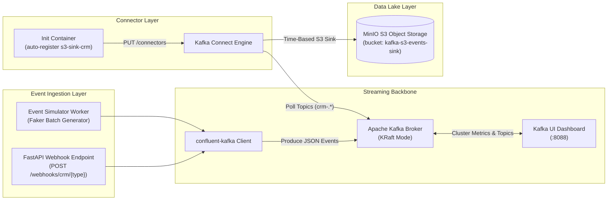
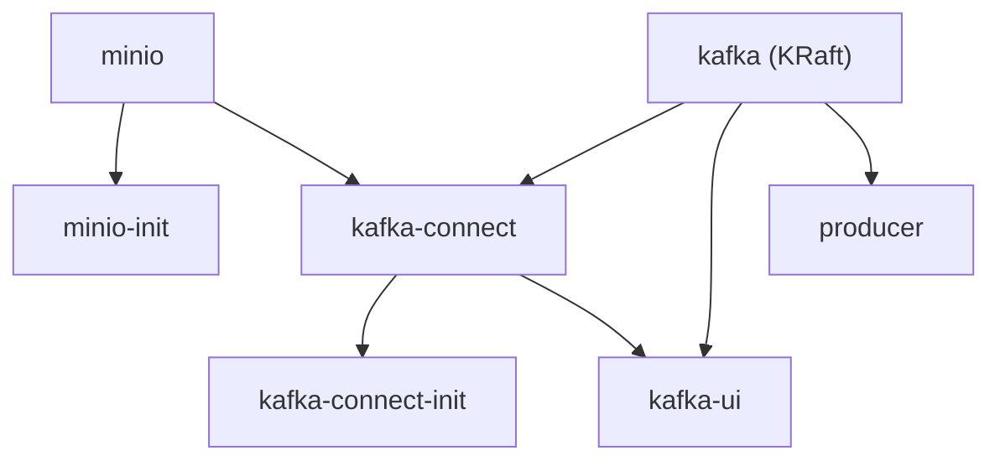

# Architecture & Technical Design

This document details the architecture, design choices, infrastructure components, and storage topology of the Python Kafka S3 Event Pipeline platform.

---

## System Overview

The platform implements a real-time event-driven streaming architecture. Event producers (FastAPI API and mock generator) stream JSON payload envelopes into an Apache Kafka cluster running in ZooKeeper-less KRaft mode. Kafka Connect consumes messages from dynamic CRM topics (`crm-.*`) and streams them into MinIO object storage in time-partitioned JSON format.



---

## Tech Stack & Components

- **Event Producer & API:** Python 3.10, FastAPI 0.110+, `confluent-kafka` 2.15.0, `pydantic` 2.6+, `faker` 24.0+
- **Message Broker:** Confluent Apache Kafka 7.6.0 (KRaft mode enabled without ZooKeeper dependency)
- **Connector Engine:** Confluent Kafka Connect 7.6.0 with Confluent S3 Sink Connector plugin 10.5.13
- **Object Storage:** MinIO `RELEASE.2025-09-07T16-13-09Z-cpuv1` (S3-compatible local object store hosting the event lake)
- **Monitoring GUI:** Provectus Kafka UI `v0.7.2` (Visualizing broker stats, topics, consumer groups, and connector health)
- **Sidecar Initializers:**
  - `minio-init` (`minio/mc`): Idempotently creates the target `kafka-s3-events-sink` S3 bucket on startup.
  - `kafka-connect-init` (`alpine` + `curl`/`jq`): Auto-registers JSON connector specs via Kafka Connect REST API (`http://kafka-connect:8083`).

---

## End-to-End Data Lifecycle

1. **Event Ingestion & Generation:**
   - **Manual Webhooks:** Clients send HTTP `POST` requests to `/webhooks/crm/{object_type}` with custom JSON payloads.
   - **Continuous Simulation:** An asynchronous Python event loop (`generator.py`) generates mock events in configurable interval batches (15–30 events per batch) using `Faker`.
2. **Event Packaging & Delivery:**
   - Events are wrapped in a standard event envelope containing `event_id`, `event_type`, `object_type`, `object_id`, `timestamp` (UTC ISO 8601), and entity `data`.
   - The `KafkaEventProducer` serializes keys (`object_id`) and values (JSON string), delivering them asynchronously to topic `crm-<object_type>` with `acks=all`.
3. **Kafka Connect Streaming:**
   - `kafka-connect` monitors Kafka topics matching regex `crm-.*` using the `s3-sink-crm` connector configuration.
   - Incoming records are accumulated until reaching either `flush.size: 15` records or `rotate.interval.ms: 60000` (1 minute).
4. **Partitioned S3 Landing:**
   - The connector uses `TimeBasedPartitioner` with `Wallclock` timestamp extraction to group records into hourly Hive partitions inside MinIO bucket `kafka-s3-events-sink`.

---

## Storage Topology & Architectural Design Decisions

### 1. KRaft Mode Architecture (ZooKeeper-less Kafka)
The platform uses Kafka KRaft consensus mode (`KAFKA_PROCESS_ROLES=broker,controller`), eliminating ZooKeeper infrastructure overhead. This simplifies local cluster initialization and reduces startup latency.

### 2. Auto-Registration Sidecar Pattern
Connector configurations are stored declaratively as JSON files in [`kafka-connect/connectors/`](file:///C:/Users/alias/repos/python-kafka-s3-event-pipeline/kafka-connect/connectors). The `kafka-connect-init` container waits for Kafka Connect REST API healthiness, then executes `PUT /connectors/<name>/config` requests. This guarantees that connectors are automatically configured on startup without requiring manual REST calls.

### 3. Dynamic Topic Routing & S3 Partitioning
The S3 Sink connector matches topics using `topics.regex: "crm-.*"`, allowing new CRM topics (e.g. `crm-quotes`) to be automatically captured by the sink connector without modifying connector configs.

Paths in S3 adhere to Hive-compatible time partitioning:
`s3://kafka-s3-events-sink/crm-<object_type>/year=YYYY/month=MM/day=DD/hour=HH/`

Example S3 URI:
`s3://kafka-s3-events-sink/crm-contacts/year=2026/month=08/day=23/hour=23/crm-contacts+0+0000000000.json`

---

## Event Payload Schema & Envelope Format

All events emitted by the producer follow a consistent JSON envelope schema:

```json
{
  "event_id": "evt_a1b2c3d4e5f6",
  "event_type": "contact.created",
  "object_type": "contacts",
  "object_id": "con_1a2b3c4d",
  "timestamp": "2026-08-23T23:30:00.000000+00:00",
  "data": {
    "first_name": "Jane",
    "last_name": "Doe",
    "email": "jane.doe@example.com",
    "lifecycle_stage": "opportunity"
  }
}
```

### Supported Entities & Event Types

| Object Type | Topic | Event Types | Sample Payload Data |
| :--- | :--- | :--- | :--- |
| `contacts` | `crm-contacts` | `contact.created`, `contact.updated`, `contact.lifecycle_changed` | `first_name`, `last_name`, `email`, `lifecycle_stage` |
| `leads` | `crm-leads` | `lead.created`, `lead.qualified`, `lead.status_updated` | `lead_score`, `source`, `status` |
| `deals` | `crm-deals` | `deal.created`, `deal.stage_updated`, `deal.closed_won`, `deal.closed_lost` | `deal_name`, `amount`, `currency`, `stage` |
| `engagements` | `crm-engagements` | `email.sent`, `call.completed`, `meeting.scheduled` | `channel`, `rep_email`, `duration_seconds`, `notes` |

---

## Service Dependency Graph


