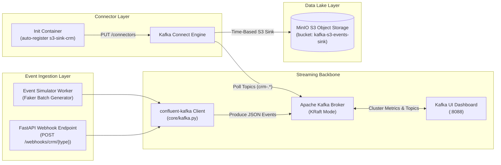

# Architecture & Technical Design

This document details the architecture, design choices, infrastructure components, and storage topology of the Python Kafka S3 Event Pipeline platform.

For exhaustive sub-component guides, refer to the [Documentation Hub](docs/README.md).

---

## System Overview

The platform implements a real-time event-driven streaming architecture. Event producers (FastAPI REST API and async event simulator) stream JSON payload envelopes into an Apache Kafka cluster running in ZooKeeper-less KRaft mode. Kafka Connect consumes messages from dynamic CRM topics (`crm-.*`) and streams them into MinIO object storage in time-partitioned JSON format.



---

## Tech Stack & Components

- **Event Producer & API:** Python 3.10, FastAPI 0.110+, `confluent-kafka` 2.15.0, `pydantic` 2.6+, `pydantic-settings` 2.2+, `faker` 24.0+
- **Message Broker:** Confluent Apache Kafka 7.6.0 (KRaft mode enabled without ZooKeeper dependency)
- **Connector Engine:** Confluent Kafka Connect 7.6.0 with Confluent S3 Sink Connector plugin 10.5.13
- **Object Storage:** MinIO `RELEASE.2025-09-07T16-13-09Z-cpuv1` (S3-compatible local object store hosting the event lake)
- **Monitoring GUI:** Provectus Kafka UI `v0.7.2` (Visualizing broker stats, topics, consumer groups, and connector health)
- **Sidecar Initializers:**
  - `minio-init` (`minio/mc`): Idempotently creates the target `kafka-s3-events-sink` S3 bucket on startup.
  - `kafka-connect-init` (`alpine` + `curl`/`jq`): Auto-registers JSON connector specs via Kafka Connect REST API (`http://kafka-connect:8083`).

---

## FastAPI Modular Producer Architecture

The Producer service is organized into a **Layered (Service-Oriented) Architecture with Versioned Routers**:

```text
producer/
└── app/
    ├── main.py                     # Entrypoint & FastAPI lifespan setup
    ├── core/                       # App configuration & singleton clients
    │   ├── config.py               # Pydantic BaseSettings (reads .env variables)
    │   └── kafka.py                # Kafka Producer client & delivery callbacks
    ├── api/                        # Route Handlers / APIRouters
    │   └── v1/
    │       ├── router.py           # API router aggregator
    │       └── endpoints/
    │           ├── webhooks.py     # Ingest webhook routes (/webhooks/crm/{type})
    │           └── simulation.py   # Simulation control routes (/simulation/*)
    ├── schemas/                    # Data contracts & Validation Models
    │   ├── events.py               # WebhookPayload, EventEnvelope, Entity models
    │   └── responses.py            # Standardized API response models
    └── services/                   # Business logic & Background tasks
        ├── generator.py            # Background asyncio event simulator worker
        └── mock_factory.py         # Faker data generators for CRM entities
```

---

## Deep Dive Architecture Documentation

For complete technical specifications, see the dedicated architecture guides:

- **[System Overview & Dependency Graphs](docs/architecture/overview.md)** — Service inventory, network ports, and container orchestration flow.
- **[Kafka Broker & Connect Mechanics](docs/architecture/kafka-broker-connect.md)** — KRaft metadata consensus, partition hashing keys, and memory flush triggers.
- **[Data Lifecycle & Hive Partitioning](docs/architecture/data-lifecycle.md)** — Event envelope schema definitions, topic mapping, and S3 directory naming rules.
- **[Configuration Reference](docs/reference/configuration.md)** — Variable-by-variable documentation of all `.env` files and connector parameters.
- **[API Reference](docs/reference/api-endpoints.md)** — Webhook endpoints and simulator control routes.
