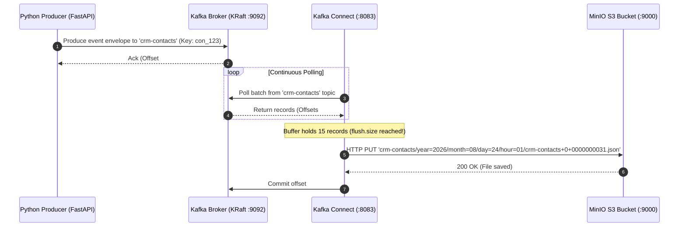

# 📚 Kafka Broker & Connector Engine Guide

This document provides a detailed breakdown of the **Apache Kafka Message Broker (KRaft Mode)** and the **Kafka Connect S3 Sink Engine** within the Python Kafka S3 Event Pipeline platform.

---

## 🧠 High-Level Concept: Broker vs. Connector Engine

```text
┌────────────────────────────────┐         ┌────────────────────────────────┐
│   Apache Kafka Message Broker  │         │      Kafka Connect Engine      │
│ ────────────────────────────── │         │ ────────────────────────────── │
│ • High-performance event log   │  ═══>   │ • Managed Consumer Runtime     │
│ • Holds topics in memory/disk  │ (Streams│ • Reads from Kafka topics      │
│ • Manages partitions & offsets │  Topics)│ • Flushes files to S3 / MinIO  │
└────────────────────────────────┘         └────────────────────────────────┘
```

1. **Kafka Broker (`kafka`):** The **buffer and backbone**. It receives events from Python, stores them safely in partitioned commit logs, and keeps track of offset positions. It doesn't know or care about S3 or files.
2. **Kafka Connect Engine (`kafka-connect`):** The **data pipeline worker**. It continuously polls topics from the Broker, packages events into batches, and writes them out to MinIO S3 as formatted JSON/Parquet files.

---

## 1. ⚙️ Part 1: The Kafka Message Broker (KRaft Mode)

### A. What is KRaft Mode?
Traditionally, Apache Kafka required an external cluster management system called **Apache ZooKeeper** to manage cluster metadata, leader elections, and topic configurations. 

In your setup (`confluentinc/cp-kafka:7.6.0`), Kafka runs in **KRaft Mode (Kafka Raft Metadata Mode)**:
- **No ZooKeeper:** The broker manages its own internal consensus log using the **Raft consensus protocol**.
- **Container config (`.docker/kafka/.env`):**
  ```properties
  KAFKA_PROCESS_ROLES=broker,controller
  KAFKA_NODE_ID=1
  KAFKA_CONTROLLER_QUORUM_VOTERS=1@kafka:29093
  ```
  The container acts as both a **data broker** (handling client requests on port `29092`/`9092`) and a **metadata controller** (on port `29093`).

---

### B. Topics & Message Envelope
When Python sends an event, Kafka stores it in a **Topic** (an append-only log). 

In your app, events are published to dynamic topics matching the entity type:
- `crm-contacts`
- `crm-leads`
- `crm-deals`
- `crm-engagements`

#### How Python produces to Kafka (`producer/app/core/kafka.py`):
```python
self.producer.produce(
    topic="crm-contacts",
    key="con_1a2b3c4d",   # Object ID used as Kafka Partition Key
    value=serialized_json_bytes,
    callback=self._delivery_callback
)
```
- **Partition Key (`object_id`):** Kafka hashes the key (`con_1a2b3c4d`) to guarantee that all updates for *the same contact* always land in the *same Kafka partition* in strict chronological order.
- **Acknowledgements (`acks=all`):** Ensures Kafka writes the message to disk before acknowledging back to the Python app, guaranteeing zero data loss.

---

## 2. 🔌 Part 2: The Kafka Connect Engine & S3 Sink Connector

### A. What is Kafka Connect?
Kafka Connect is a scalable, fault-tolerant runtime framework for integrating Kafka with external systems (databases, object storage, search indexes) **without writing custom consumer code**.

Instead of writing a custom Python loop that reads from Kafka and uploads to S3, Kafka Connect runs a dedicated Java runtime container (`kafka-connect`) executing the official **Confluent S3 Sink Connector** (`io.confluent.connect.s3.S3SinkConnector`).

---

### B. Auto-Registration Sidecar (`kafka-connect-init`)
When you run `docker compose up`, how does Kafka Connect know what to ingest?

1. **`kafka-connect` container starts up:** Loads the S3 Sink JAR plugin (`.docker/kafka-connect/Dockerfile`).
2. **`kafka-connect-init` container fires up:** A lightweight Alpine container waits for Kafka Connect's REST API (`http://kafka-connect:8083`) to respond (`.docker/kafka-connect/init-connectors.sh`).
3. **Auto-Registers JSON Configuration:** It sends a `PUT` request with `kafka-connect/connectors/s3-sink-crm.json`.

---

### C. Deep Dive: Connector Settings (`s3-sink-crm.json`)

Here is how each property in `kafka-connect/connectors/s3-sink-crm.json` controls the pipeline:

```json
{
  "name": "s3-sink-crm",
  "config": {
    "connector.class": "io.confluent.connect.s3.S3SinkConnector",
    "topics.regex": "crm-.*",
    "s3.bucket.name": "kafka-s3-events-sink",
    "store.url": "http://minio:9000",
    "format.class": "io.confluent.connect.s3.format.json.JsonFormat",

    "flush.size": "15",
    "rotate.interval.ms": "60000",

    "partitioner.class": "io.confluent.connect.storage.partitioner.TimeBasedPartitioner",
    "path.format": "'year'=YYYY/'month'=MM/'day'=dd/'hour'=HH",
    "partition.duration.ms": "3600000",
    "timestamp.extractor": "Wallclock"
  }
}
```

#### 1. Dynamic Topic Capture (`topics.regex: "crm-.*"`)
Instead of hardcoding topic names, the connector continuously monitors the broker for any topic starting with `crm-`. If you publish to a new topic like `crm-quotes`, Kafka Connect automatically starts streaming it to S3!

#### 2. Flush Mechanics (`flush.size` vs `rotate.interval.ms`)
Kafka Connect buffers records in memory before writing a file to MinIO S3. A file is committed to S3 whenever **either** of these two conditions is met first:
- **`flush.size: 15`**: As soon as **15 records** arrive in a topic, flush them to S3 as a file.
- **`rotate.interval.ms: 60000` (1 minute)**: If 15 records haven't arrived yet, flush whatever is in memory after **1 minute** to prevent data from getting stuck in memory.

#### 3. Time-Based Partitioning (`TimeBasedPartitioner`)
The connector automatically creates Hive-style folder hierarchies inside MinIO based on the ingestion time (`Wallclock`):

```text
s3://kafka-s3-events-sink/
└── crm-contacts/
    └── year=2026/
        └── month=08/
            └── day=24/
                └── hour=01/
                    └── crm-contacts+0+0000000000.json
```
- **`crm-contacts`**: S3 prefix matches the Kafka topic name.
- `+0+0000000000`: `+[partition]+[starting_offset]`. This naming scheme guarantees that file writes are **idempotent** — if Kafka Connect restarts, it won't duplicate files.

---

## 🔄 Complete Step-by-Step Message Journey

Here is what happens when a single event flows through the entire pipeline:


