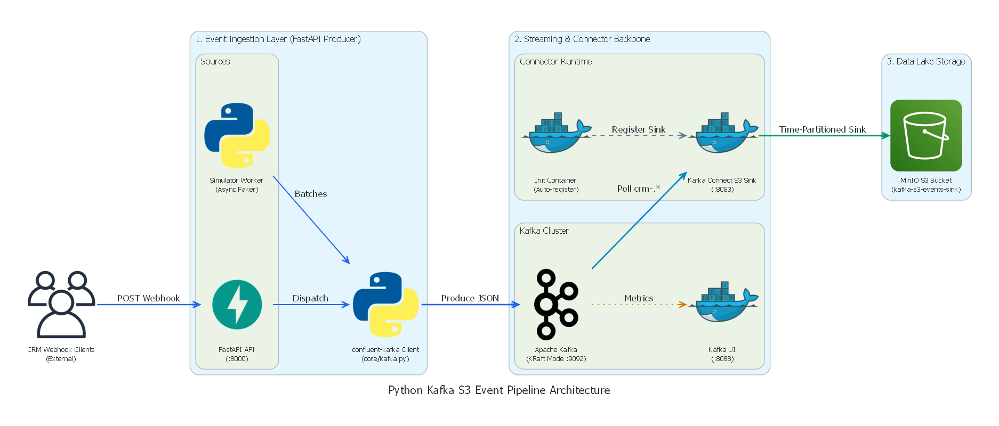
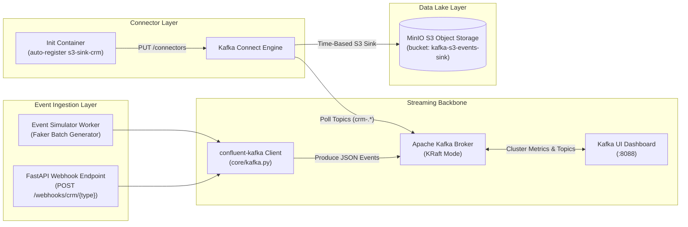
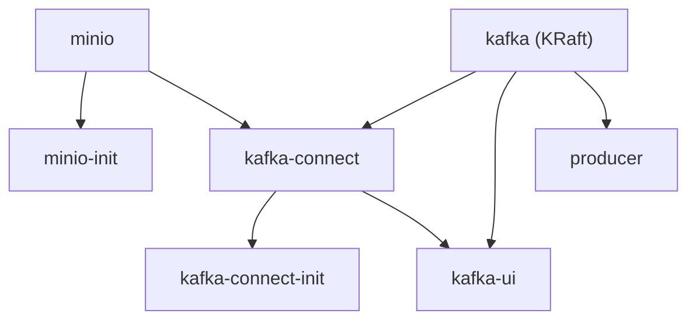

# 🏗️ Architecture Overview

This document provides a high-level overview of the system topology, core infrastructure services, and component dependencies for the Python Kafka S3 Event Pipeline platform.

---

## 1. System Topology & Flowchart

The platform connects event ingestion, streaming message brokering, managed connector ETL, and local object storage into a cohesive real-time event pipeline:

<b>View Text Mermaid Flowchart</b>

> 💡 *Visual diagram is generated with Diagrams-as-Code. See the [Diagram Generation Guide](../guides/generate-diagrams.md) to modify and regenerate.*

---

## 2. Infrastructure Components & Ports

| Service | Container Name | Port (Host:Container) | Image / Version | Description |
| :--- | :--- | :--- | :--- | :--- |
| **Kafka Broker** | `kafka` | `9092:9092` | `confluentinc/cp-kafka:7.6.0` | KRaft consensus broker & controller (ZooKeeper-less). |
| **Kafka Connect** | `kafka-connect` | `8083:8083` | Custom (based on `cp-kafka-connect-base:7.6.0`) | Connect runtime hosting Confluent S3 Sink plugin `10.5.13`. |
| **Connect Init** | `kafka-connect-init` | *N/A (sidecar)* | `alpine:3.19` | Idempotently auto-registers connector JSON definitions on startup. |
| **MinIO S3 Storage** | `minio_data_lake` | `9000:9000` / `9001:9001` | `minio/minio:RELEASE.2025-09-07T16-13-09Z-cpuv1` | S3-compatible object store API (`:9000`) and web console (`:9001`). |
| **MinIO Init** | `minio_init` | *N/A (sidecar)* | `minio/mc:RELEASE.2025-08-13T08-35-41Z-cpuv1` | Creates initial bucket `kafka-s3-events-sink` via MinIO Client (`mc`). |
| **Kafka UI** | `kafka-ui` | `8088:8080` | `provectuslabs/kafka-ui:v0.7.2` | Web GUI for topic exploration, consumers, and connector health. |
| **Producer API** | `event-producer` | `8000:8000` | Custom (Python `3.10.16-slim`) | FastAPI REST API and async event simulator worker. |

---

## 3. Service Dependency Graph

---

## 4. Next Reading

- [Kafka Broker & Connect Deep Dive](kafka-broker-connect.md) — Detailed mechanics of KRaft consensus, listener networking, and connector buffering.
- [Data Lifecycle & Partitioning](data-lifecycle.md) — Event payload envelopes, topic schemas, and Hive directory layouts.
- [Configuration Reference](../reference/configuration.md) — Variable-by-variable documentation of all `.env` files and connector JSON.
